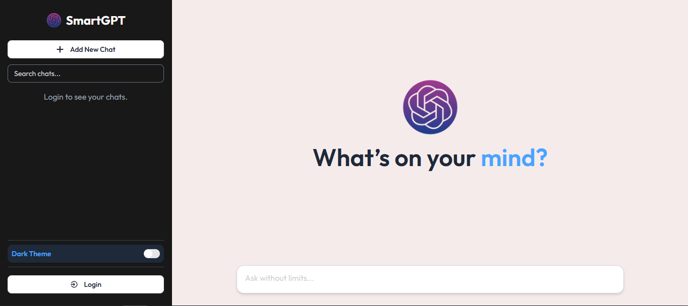

# SmartGPT - AI Chatbot (MERN Stack)

## 📚 Table of Contents

- [Description](#-description)
- [Live Demo](#-live-demo)
- [API Documentation with Swagger](#-api-documentation-with-swagger)
- [Features](#-features)
- [Tech Stack](#️-tech-stack)
- [Setup and Installation](#️-setup-and-installation)
- [Environment Variables](#-environment-variables)
- [Author Info](#-author-info)

## 📝 Description

SmartGPT is a full-stack AI chatbot and image generator platform that combines the power of OpenAI and Google Gemini to generate intelligent, context-aware responses and creative content. In addition to text-based conversations, it allows users to create unique AI-generated images, which are securely stored and managed via ImageKit.

The platform is protected by a strong authentication system, ensuring that only registered users can access its features, while each chat and image is securely stored in the user’s account for future reference. Built with a modern frontend using React and TailwindCSS and a scalable backend powered by Node.js, Express and MongoDB, SmartGPT provides a seamless, professional and secure experience for interacting with AI.

## 🚀 Live Demo

[](https://smart-gpt-app-client.vercel.app/)

## 🔍 API Documentation with Swagger

Explore the full API documentation here: https://smartgpt-server.onrender.com/docs

## ✨ Features

#### `Secure Authentication`

- Register and log in using email and password.
- Passwords are encrypted with bcrypt for security.
- JSON Web Token (JWT) is used for authentication.
- Without login, no user can access any feature.

#### `AI Chatbot`

- Generate AI-powered responses for any text prompt.
- Works like ChatGPT, giving intelligent answers instead of simple messaging.
- Each conversation is saved securely in the user’s account.

#### `AI Image Generation`

- Generate unique images from your own prompts.
- Images are uploaded and stored using ImageKit.

#### `Chat Management`

- **Search Chats** – Find specific conversations quickly.
- **Delete Chats** – Remove unwanted chats individually.
- **Chat History** – Access your past prompts and responses anytime.

#### `Backend API with Swagger`

- RESTful API designed using Express.js and MongoDB.
- Fully documented with Swagger UI.
- Organized structure for scalability and easy integration.

## 🛠️ Tech Stack

- **`Frontend:`**

  - React 19 + Vite
  - JavaScript
  - Tailwind CSS + shadcn/ui
  - Redux Toolkit + Redux Persist
  - React Router DOM
  - React Hook Form + Zod
  - React Markdown
  - PrismJS
  - React Hot Toast
  - React Icons
  - Axios
  - Prop-Types

- **`Backend:`**
  - Node.js & Express.js
  - JavaScript
  - MongoDB + Mongoose
  - JWT + bcryptjs
  - Swagger UI + Express OpenAPI Validator + YAMLJS
  - Morgan + Cors + dotenv
  - Axios
- **`AI Integration:`**
  - OpenAI
  - Google Gemini AI
  - ImageKit

## ⚙️ Setup and Installation

### Step-by-step instructions for cloning and running locally:

```
git clone https://github.com/Mohosin999/AI-Chatbot-SmartGPT-App-MERN-Stack.git
```

Here you will find two folders `backend` and `frontend`

- cd backend
- npm install
- npm run dev

Backend runs at: http://localhost:3000

- cd frontend
- npm install
- npm run dev

Frontend runs at: http://localhost:5173

## 🔑 Environment Variables

Create a `.env` file in the root directory of the project and add the following variables:

**Backend:**

```
MONGODB_URL=
PORT=3000
ACCESS_TOKEN_SECRET=

# GEMINI
GEMINI_API_KEY=

# ImageKit
IMAGEKIT_PUBLIC_KEY=
IMAGEKIT_PRIVATE_KEY=
IMAGEKIT_URL_ENDPOINT=
```

**Frontend:**

```
VITE_BASE_URL=http://localhost:3000/api/v1
```

## 📬 Author Info

👤 **Mohosin Hasan Akash**

- 💼 **LinkedIn:** [linkedin.com/in/mohosinh99/](https://www.linkedin.com/in/mohosinh99/)
- 🌐 **Portfolio:** [personal-portfolio.com](https://personal-portfolio-website-brown-nine.vercel.app/)
- 📧 **Email:** mohosin.hasan.akash@gmail.com
